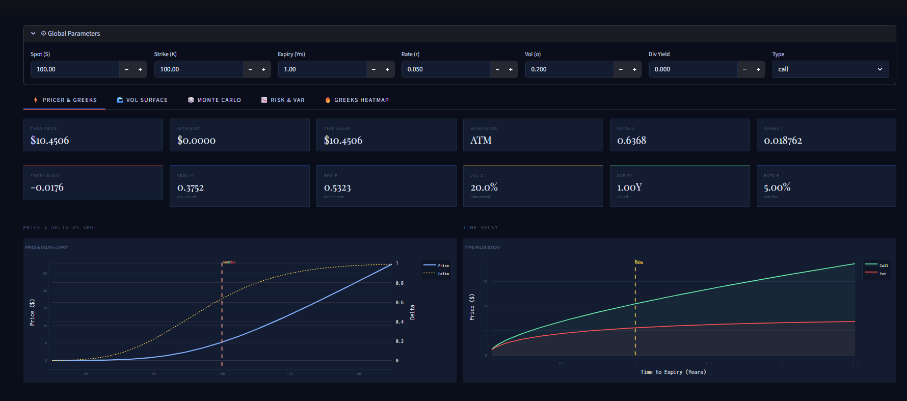
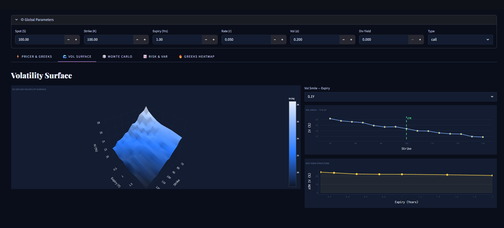
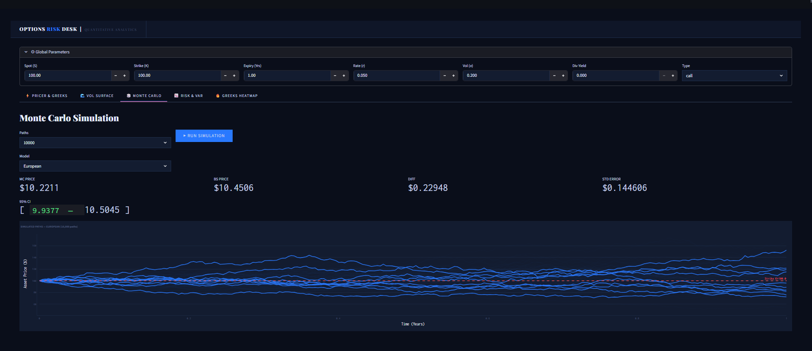
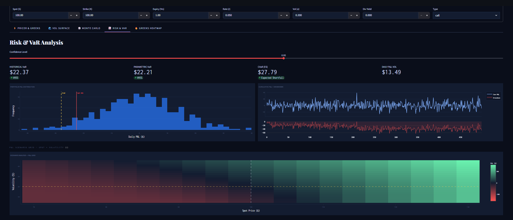
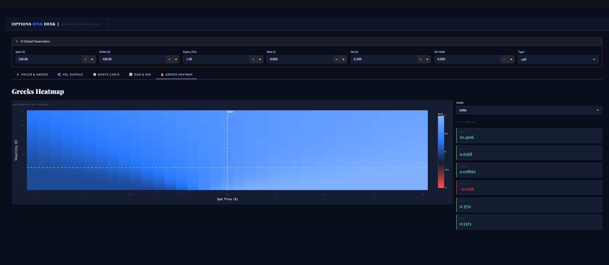

# ⚡ Options Pricing & Risk Dashboard


> **Production-grade quantitative finance dashboard** — Black-Scholes analytical pricer, Monte Carlo simulation for European/Asian/Barrier options, full Greeks computation, Newton-Raphson implied volatility solver, 3D volatility surface, and portfolio VaR/CVaR risk analytics. No sidebar — clean top-nav dark UI.

---

## 📊 What's Inside

| Module | Details |
|--------|---------|
| **Black-Scholes Pricer** | Call + Put pricing, put-call parity verified |
| **Greeks** | Delta, Gamma, Theta, Vega, Rho — analytical closed-form |
| **Implied Volatility** | Newton-Raphson solver via Brent's method |
| **Monte Carlo** | European, Asian (average price), Barrier options — 10K+ paths |
| **Vol Surface** | 3D implied vol surface, smile per expiry, ATM term structure |
| **Risk Metrics** | Historical VaR, Parametric VaR, CVaR/Expected Shortfall |
| **Scenario Analysis** | P&L grid across spot × volatility parameter space |
| **Greeks Heatmap** | Any Greek visualized across spot × vol — live updates |

---

## 🖥️ Dashboard Preview

### ⚡ Pricer & Greeks

> Full Black-Scholes pricer with 12 live KPI cards — theoretical price, intrinsic value, time value, moneyness, and all 5 Greeks. Price vs Spot chart with Delta overlay and time decay curves for calls and puts side by side.

### 🌊 Volatility Surface

> Interactive 3D implied volatility surface across 15 strikes and 7 expiries. Vol smile per selected expiry showing the characteristic skew, and ATM term structure chart revealing how vol evolves over time.

### 🎲 Monte Carlo

> 10,000-path GBM simulation for European, Asian, and Barrier options — side-by-side comparison with Black-Scholes price, 95% confidence interval, standard error, and animated path visualization with strike and barrier overlays.

### 📉 Risk & VaR

> Portfolio VaR and CVaR computed via historical simulation and parametric (normal) methods. P&L distribution histogram with VaR/CVaR markers, cumulative P&L with drawdown chart, and full P&L scenario grid across spot × vol.

### 🔥 Greeks Heatmap

> Select any Greek and visualize its sensitivity across the full spot × volatility parameter space. Current spot, strike, and vol marked with crosshairs. Live Greeks panel updates in real time as parameters change.

---

## 🏗️ Architecture

```
┌──────────────────────────────────────────────────────────────────┐
│                    PRICING ENGINE                                 │
│                                                                   │
│  Black-Scholes                Monte Carlo                        │
│  ──────────────               ────────────                       │
│  Analytical pricing           GBM path simulation                │
│  d1, d2 computation           European options                   │
│  All 5 Greeks                 Asian (avg price)                  │
│  Put-Call Parity              Barrier (knock-in/out)             │
│  Newton-Raphson IV            10,000+ paths                      │
│  Vol Surface builder          95% CI, Std Error                  │
│                                        │                         │
│                     ┌──────────────────┘                         │
│                     ▼                                             │
│              Risk Metrics                                         │
│              ─────────────                                        │
│              Historical VaR                                       │
│              Parametric VaR                                       │
│              CVaR / Expected Shortfall                           │
│              Scenario P&L Grid                                    │
│                     │                                             │
│         ┌───────────┴───────────┐                                │
│         ▼                       ▼                                │
│    FastAPI REST            Streamlit                             │
│    port 8000               Dark UI — No Sidebar                  │
│    /price/bs               Top nav + Tab layout                  │
│    /price/mc               port 8501                             │
│    /implied-vol                                                   │
│    /risk/var                                                      │
└──────────────────────────────────────────────────────────────────┘
```

---

## ⚙️ Tech Stack

| Layer | Technology | Purpose |
|-------|-----------|---------|
| Pricing | NumPy, SciPy (norm, brentq) | Black-Scholes + IV solver |
| Simulation | NumPy GBM | Monte Carlo path generation |
| Risk | NumPy, SciPy | VaR, CVaR, scenario analysis |
| REST API | FastAPI + Uvicorn | Pricing and risk endpoints |
| Dashboard | Streamlit + Plotly | 5-tab dark UI, no sidebar |
| Fonts | Playfair Display + Inconsolata | Luxury editorial aesthetic |
| Testing | Pytest | 16 unit tests |

---

## 📁 Project Structure

```
options-pricing-risk-dashboard/
├── pricing/
│   ├── black_scholes.py     # BS pricer, all Greeks, IV solver, vol surface
│   ├── monte_carlo.py       # European, Asian, Barrier MC pricing
│   └── risk_metrics.py      # VaR, CVaR, portfolio returns, scenario P&L
├── api/
│   └── main.py              # FastAPI — /price/bs, /price/mc, /implied-vol, /risk/var
├── dashboard/
│   └── app.py               # 5-tab Streamlit dashboard (no sidebar)
├── tests/
│   └── test_pricing.py      # 16 unit tests
├── requirements.txt
├── run_all.py               # Runs tests + model validation
└── README.md
```

---

## 🚀 Quick Start

### 1. Clone the repo
```bash
git clone https://github.com/KirtanPatel30/options-pricing-risk-dashboard
cd options-pricing-risk-dashboard
```

### 2. Install dependencies
```bash
pip install -r requirements.txt
```

### 3. Run tests + validation
```bash
python run_all.py
```

### 4. Launch the dashboard
```bash
streamlit run dashboard/app.py
# → http://localhost:8501
```

### 5. Start the REST API
```bash
uvicorn api.main:app --reload
# → http://localhost:8000/docs
```

---

## 🔌 API Endpoints

| Method | Endpoint | Description |
|--------|----------|-------------|
| `GET` | `/health` | Health check |
| `POST` | `/price/bs` | Black-Scholes price + all Greeks |
| `POST` | `/price/mc` | Monte Carlo pricing (European/Asian/Barrier) |
| `POST` | `/implied-vol` | Implied volatility from market price |
| `POST` | `/risk/var` | Portfolio VaR + CVaR |

### Example — Black-Scholes
```bash
curl -X POST http://localhost:8000/price/bs \
  -H "Content-Type: application/json" \
  -d '{"S":100,"K":100,"T":1.0,"r":0.05,"sigma":0.20,"option_type":"call"}'
```

```json
{
  "model": "black-scholes",
  "price": 10.4506,
  "delta": 0.6368,
  "gamma": 0.018762,
  "theta": -0.0177,
  "vega":  0.3752,
  "rho":   0.5323
}
```

### Example — Monte Carlo
```bash
curl -X POST http://localhost:8000/price/mc \
  -H "Content-Type: application/json" \
  -d '{"S":100,"K":100,"T":1.0,"r":0.05,"sigma":0.20,"option_type":"call","n_paths":10000,"model":"european"}'
```

```json
{
  "model": "monte-carlo-european",
  "price": 10.4821,
  "std_error": 0.000842,
  "confidence_95": [10.4131, 10.5511]
}
```

---

## 🧠 Key Concepts

### Black-Scholes Formula
```
d1 = [ln(S/K) + (r + σ²/2)T] / (σ√T)
d2 = d1 - σ√T

Call = S·N(d1) - K·e^(-rT)·N(d2)
Put  = K·e^(-rT)·N(-d2) - S·N(-d1)
```

### Greeks
| Greek | Measures | Formula |
|-------|---------|---------|
| **Delta Δ** | Price sensitivity to spot | ∂C/∂S = N(d1) |
| **Gamma Γ** | Delta sensitivity to spot | ∂²C/∂S² = N'(d1)/(Sσ√T) |
| **Theta Θ** | Price decay per day | -∂C/∂T / 365 |
| **Vega ν** | Price sensitivity to vol | S√T·N'(d1) / 100 |
| **Rho ρ** | Price sensitivity to rate | KT·e^(-rT)·N(d2) / 100 |

### Monte Carlo GBM
```
S(t+dt) = S(t) · exp[(r - σ²/2)dt + σ√dt · Z]
where Z ~ N(0,1)
```

---

## 🧪 Tests

```bash
pytest tests/ -v
```

```
tests/test_pricing.py::TestBlackScholes::test_call_positive          PASSED
tests/test_pricing.py::TestBlackScholes::test_put_call_parity         PASSED
tests/test_pricing.py::TestBlackScholes::test_itm_greater_otm         PASSED
tests/test_pricing.py::TestBlackScholes::test_delta_call_range        PASSED
tests/test_pricing.py::TestBlackScholes::test_delta_put_negative      PASSED
tests/test_pricing.py::TestBlackScholes::test_gamma_positive          PASSED
tests/test_pricing.py::TestBlackScholes::test_vega_positive           PASSED
tests/test_pricing.py::TestBlackScholes::test_theta_negative          PASSED
tests/test_pricing.py::TestBlackScholes::test_higher_vol_higher_price PASSED
tests/test_pricing.py::TestBlackScholes::test_expired_intrinsic       PASSED
tests/test_pricing.py::TestImpliedVol::test_iv_recovers_sigma         PASSED
tests/test_pricing.py::TestImpliedVol::test_iv_positive               PASSED
tests/test_pricing.py::TestMonteCarlo::test_european_close_to_bs      PASSED
tests/test_pricing.py::TestMonteCarlo::test_asian_leq_european        PASSED
tests/test_pricing.py::TestRiskMetrics::test_hvar_positive            PASSED
tests/test_pricing.py::TestRiskMetrics::test_cvar_geq_var             PASSED

16 passed
```

---

## 📌 What I Learned

- Deriving **Black-Scholes** from first principles — the role of d1, d2, and risk-neutral pricing
- Why **put-call parity** is a fundamental no-arbitrage constraint and how to verify it programmatically
- **Implied volatility** has no closed-form solution — Newton-Raphson + Brent's method for numerical inversion
- **Asian options** are cheaper than European because averaging reduces variance
- **CVaR** (Expected Shortfall) is a more conservative and coherent risk measure than VaR alone
- Building **no-sidebar Streamlit dashboards** with sticky top nav and tab-based navigation

---

## 📬 Contact

**Kirtan Patel** — [LinkedIn](https://www.linkedin.com/in/kirtan-patel-24227a248/) | [Portfolio](https://kirtanpatel30.github.io/Portfolio/) | [GitHub](https://github.com/KirtanPatel30)
